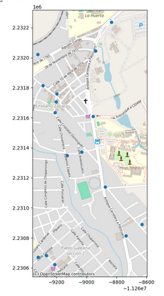

<h1 align="center">Emerging-network-of-care-for-enesian-women</h1>

## Author 
- [Ashley Dafne Aguilar Salinas - UNAM ENES Morelia](https://github.com/AshleyDafneAguilar)

## Introduction 
The Emerging Network of Enesian Care is a group that started in April 2023 at UNAM, ENES Morelia. Its purpose is to promote a network of care and support for women studying on campus.
This group is made up of teachers and students from different careers on campus. Each of us has different tasks to achieve our goal. 

Here I will upload some of the contributions that I will be developing as a member of this network. 

## Recent activities
The following work aims to map the risk zones around UNAM, ENES Morelia. These data were collected thanks to the participation of students, professors and academic staff of the University according to their experiences.
To achieve the mapping of the risk zones we made use of libraries and functions such as pandas, pandas.ExcelFile, geopandas, numpy, matplotlib.pyplot, etc. from Python

**Note:**
*The file containing the risk zones is an Excel file (.xlsx extension) located inside the dataset folder.*

